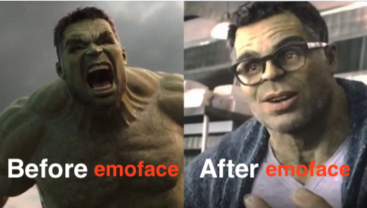
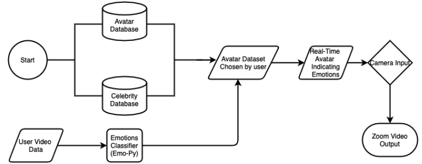
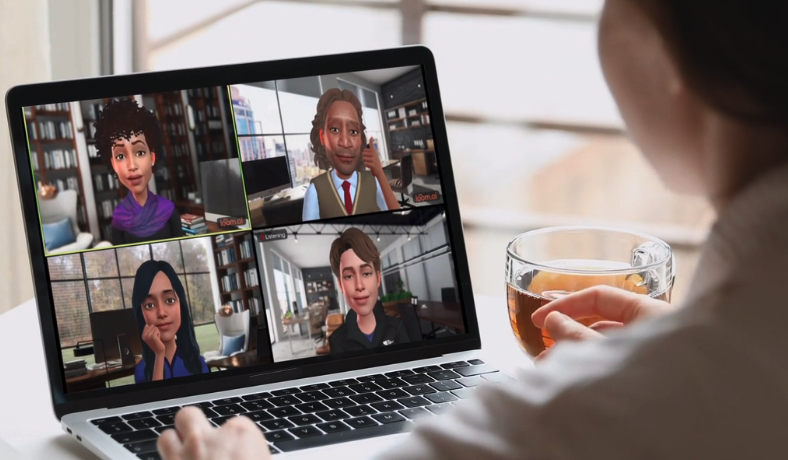

```toc
# This code block gets replaced with the TOC
```
## Scenarios
1. Ahmed was just invited to a zoom call to attend his first class early in the morning. He breathes in and out before clicking on the “join zoom button”. He clicks on the Zoom preferences to check that his camera and audio are turned off before attending the call. He also checks that his laptop camera is covered by his custom webcam cover. Once he makes sure that his camera is not activated and that his camera is covered, he joins the call. During the call, Ahmed wants to show the professor that he is engaged in the class, but he hesitates between turning on his camera or putting a “thumbs up” in the Zoom call. He ends up putting a “thumbs up” which the professor mistakes for a question.
<p></p>

2. In an online Zoom-based comedy show for first-year students, the host does not know whether the jokes that he is saying are funny or not. That is because the majority of the people attending have turned off their cameras. If the attendees had a way of expressing their ideas then the host would not have been unaware that his jokes lack humour.
<p></p>

3. Julie is sitting in a coffee shop and attending her first conference of the day. The coffee shop is packed with lots of customers walking back and forth. She would like to share her feelings with her facial expressions in a fun way but to avoid showing other customers. 
<p></p>

4. Aicha is in the middle of conversation during a Teams call, having a casual conversation with her colleagues. Her camera is not turned off, but her audio is on. One of her colleagues says something to Aicha which Aicha finds to be not flattering. Aicha hesitates between sending a private message to the person to let them know that they did not appreciate what they said.
<p></p>

5. John is attending his class in an airbnb place that he rented which is located in the mountains. The internet connection is unreliable and can only be used to either send or receive high quality videos. Since he wants to be sure of getting the video of his professor’s desktop, he has to turn off his video. 
<p></p>

6. Hadi has weekly meetings with his colleagues. In the meetings he is always mocked for not having any video feed. He does not want his colleagues to see his background. Also, because he uses linux most of the time, his favorite video call application, skype, does not offer background removal. Also he does not want to install commercial apps because he only uses open-source software. After buying a green screen at great expense he turns on his video but soon finds out that he does not even want his face to be shown. That is because sometimes he moves away from the keyboard and does not want others to know of this.
<p></p>

7. Atika is a muslim woman who wears a headscarf in public. She starts a video call, without her headscarf on, with her daughter abroad on her phone. Her daughter is at a cafe where some people walk around in the background and is using her computer to communicate with her mom. A waiter stops and asks if the daughter wants to order anything and quickly glances over the phone. Atika quickly puts the phone away and her daughter hides the screen of her computer so that the waiter cannot see Atika without her headscarf on. Atika quickly pulls a bed sheet and covers her hair and finishes the call with her daughter with the bed sheet covering her hair, in case someone else glances at her daughter’s computer screen while she talks to her.


## Problem description
From the observations above the following has been deduced. There exists a need to maintain a sort of shared personal space without showing the face and background of the videoconference users. Some users avoid turning on their videos because of personal preferences about being seen by other people while they are in their comfort zone, i.e. home or coffee shop. This preference is due to various factors some of which could be lack of self confidence or the desire to hide the background.
<p></p>

This leads to the fact that they are depriving other users and the host of a sort of feedback which is obtained from their facial expression. This leads to unwanted inconveniences such as unnecessary feedback in the chat box. Also, in cases that feedback is essential to the host the whole operation of the conference will be interrupted.
A possible solution to tackle this issue is to decrease the size of shared personal space in terms of video by diminishing the video that is sent by the user while keeping a way to establish a feedback for the user's facial expression.


## Personas
### Behaviors list
<div style="display: flex">
<div style="width: 50%">

   * Attend live classroom with no video on
   * Make sure that the camera cover is on the laptop
   * Make sure in the settings that the camera is disabled
   * Sometimes looks at camera during call to make sure that it is still off
   * Put “thumbs up” to show engagement
   * Ask questions in the chat to show confusion
   * Check if other participants turned on camera
   * Frequently looks at audience and scrolls down to see if anyone has camera on
   * Pauses after each sentence to see reactions
   * Frequently asks if anyone is there
   * Calls out a person’s name to start small conversation or ask if they are paying attention
   * Turn off camera to block undesirable background
   * Types down a lot of distracting emojis
   * Sometimes deletes a message with wrong emoji
   * Takes time to search through emoji menu to choose an emoji
   * Open browser to look for particular gif
   * Copy/paste gif into chat
   * Open email software to save draft
   * Send private message to show negative emotion
   * Delete private message
   * Checking around that no one else is peeking at your video call


</div>
<div style="width: 50%">

  * Turning off video to make sure you get the professor’s feed
  * Check wifi speed on google
  * Write “hahaha” or “lol” to show laughter
  * Put on makeup before call
  * Change clothes before call
  * Persist on making eye contact by looking at the camera
  * Adjust lighting
  * Constantly looking into his or her own video
  * Clean up room
  * Buy a green screen to have a good looking background
  * Turn on camera before call starts to check that the lighting/room are preferable
  * Refrain to install softwares that are closed source
  * Leaves the room in the middle of conference but no one understands
  * Use a green screen to cover up the room from others.
  * Put a cover in front of the camera even though the camera is off
  * Throw phone (with camera) away
  * Putting on a headscarf before starting a video call
  * Hide screen
  * Hide camera
  * Adjust head covering
  * Grab nearest object to cover head
  * Bite nails

</div>
</div>


### Grouping of behaviours

#### Hiding undesirable background
* Turn off camera to block undesirable background
* Buy a green screen to have a good looking background
* Clean up room
* Use a green screen to cover up the room from others.
* Adjust lighting
* Turn on camera before call starts to check that the lighting/room are preferable

#### Provide feedback in writing
* Send private message to show negative emotion
* Write “hahaha” or “lol” to show laughter
* Ask questions in the chat to show confusion

#### Provide other forms of visual feedback (emoji, stickers…)
* Put “thumbs up” to show engagement
* Types down a lot of distracting emojis
* Copy/paste gif into chat

#### Delete messages
* Open email software to save draft
* Delete private message
* Sometimes deletes a message with wrong emoji

#### Searches for better visual feedback
* Takes time to search through emoji menu to choose an emoji
* Open browser to look for particular gif

#### Adjust appearance
* Put on makeup before call
* Change clothes before call
* Adjust head covering

#### Cover head
* Putting on a headscarf before starting a video call
* Grab nearest object to cover head

#### Set up preliminary settings
* Put a cover in front of the camera even though the camera is off
* Make sure that the camera cover is on the laptop
* Make sure in the settings that the camera is disabled

#### Encourage engagement with other people
* Frequently asks if anyone is there
* Calls out a person’s name to start small conversation or ask if they are paying attention

#### Wait for other people’s engagement
* Frequently looks at audience and scrolls down to see if anyone has camera on
* Pauses after each sentence to see reactions

#### Hide screen
* Throw phone (with camera) away
* Hide screen

#### Attend live classroom with no video on
#### Sometimes looks at camera during call to make sure that it is still off
#### Check if other participants turned on camera
#### Frequently asks if anyone is there
#### Bite nails
#### Turning off video to make sure you get the professor’s feed
#### Check wifi speed on google
#### Persist on making eye contact by looking at the camera
#### Constantly looking into his or her own video
#### Refrain to install softwares that are closed source
#### Leaves the room in the middle of conference but no one understands
#### Hide camera
#### Checking around that no one else is peeking at your video call

### Pattern matching

 |Performer|Person suffering from social anxiety|Professional remote worker|Privacy attentive individual|Religious woman|Student take classes remotely|User with low-bandwidth internet|
|----|----|----|----|----|----|----|----|
Hiding undesirable background| | |x|x| |x| 
Provide other forms of visual feedback (emoji, stickers…)| |x|x|x| | | 
Adjust appearance for aesthetics| | |x|x|x|x| 
Set up preliminary settings| |x|x|x| |x|x
Attend live classroom with no video on| |x|x|x| |x| 
Sometimes looks at camera during call to make sure that it is still off| |x|x|x| |x| 
Provide feedback in writing| |x|x| | |x| 
Leaves the room in the middle of conference but no one understands| | |x| | |x| 
Searches for better visual feedback|x| | | | | | 
Encourage engagement with other people|x| | | | | | 
Wait for other people’s engagement|x| | | | | | 
Frequently asks if anyone is there|x| | | | | | 
Check if other participants turned on camera|x|x| | | | | 
Bite nails| |x| | | | | 
Delete messages| |x| | | | | 
Constantly looking into his or her own video| |x| | | | | 
Turning off video to make sure you get the professor’s feed| | | | | | |x
Check wifi speed on google| | | | | | |x
Refrain to install softwares that are closed source| | | |x| | | 
Hide screen| | | |x| | | 
Persist on making eye contact by looking at the camera|x| | |x|x| | 
Hide camera| | | |x|x| | 
Checking around that no one else is peeking at your video call| | | | |x| | 
Cover head| | | | |x| | 


### Concluded personas
#### Persona 1 Remote Performers 
Remote performers including comedians and hosts for events. They care about their interactions with the audience. The emotional and facial expression feedback from the audience is key to their performance. They will adjust their performance based on the audiences’ feedback. They persist on making eye contacts with the audience even in remote settings.


#### Persona 2 Remote Worker (professional+student)
This type of users mainly use video conferences for professional or academic meetings. They will hide the undesirable background and take care of preliminary settings to avoid any unnecessary distractions. The feedback in the meeting is mainly through writing. The shared personal space is missing for this type of users because they often turn off their cameras during the meeting. 

#### Persona 3  Sociofobia participants
Sociofobia users are nervous when meeting people face to face. They will make sure that the camera is turned off and check if others have turned off the videos too. They provide feedback mainly through writing. However, they would like their existence to be seen when they need it.

#### Persona 4 Religious Woman
In some religious beliefs, e.g. Islam, women’s hair should not be seen by other men. When such a person video calls another person, she might want to cover her hair before the call starts. Also, if she is talking with someone who is close to her there is still the need to cover her hair in some cases. For instance, if the one being called is sitting in a cafe, someone may peek at the desktop and see the woman with no head cover. This persona would be more at ease if she can convey her facial expression without sharing a direct video of her head. This would ease her burden of preparing for a video call by putting on the appropriate dress and headcover.

#### Persona 5 Privacy Protector
This group of users value their privacy. They do not want to disclose their homes’ location or decorations. They tend to hide the screen so no one can see the video conference participants’ faces. When they are in a public place such as a coffee shop, they will make sure customers in the background are not in the videos.

#### Persona 6 Bandwidth Victims 
Users with limited bandwidth have troubles in video conferences because the video is frozen often. The interaction with other participants is not smooth. 


## Use-case scenarios
### Thor, a remote worker
Thor is working as front-end developer for a tech company. Because of the lockdown he relocated back to his home Asgard and does his work remotely. Because he doesn't care about his room’s tidiness, his background is not very desirable for a work meeting. Because he does not have a green screen, the background removal tools can not help him either. After installing <span style="color: #FF4400"><b>emoface</b></span>, he simply chooses the <span style="color: #FF4400"><b>emoface</b></span> as the camera for Zoom. After selecting Captain America as the preferred face to be shown, he simply turns on his camera, knowing that the background will not be shown. Also, because he sometimes needs to save Asgard from attackers, he has to leave for a few minutes in the middle of a video call. Since he uses our app, he can choose a default emotion to be shown and simply leave the room, without his colleagues knowing about his absence. Before <span style="color: #FF4400"><b>emoface</b></span>, he used to turn off the camera which aroused the suspicion of his colleagues.<br>
<center>
<br>
    <i>Because of his poor hygiene and appearance, Thor does not always feel like turning on his camera</i>
</center>

### Hulk, Sociofobia participant
Bruce Banner, a.k.a Hulk, is taking an online course in order to improve his computer skills. Whenever he turns on his camera he becomes stressed out and angry which most of times results in the destruction of his whole room. After installing <span style="color: #FF4400"><b>emoface</b></span>, he is absolutely assured that his face and his background is not shown to the whole class. Also, when he sets the default camera on <span style="color: #FF4400"><b>emoface</b></span>, even if he mistakenly clicks on enable video, he does not need to rush to turn off the camera because he knows that his face is not going to be shown even for a brief moment. Also, previously, when he wanted to show that he is satisfied or unhappy with what the teacher is saying, he had to reach for the keyboard and type or use the mouse and select a reaction. Both of these actions were tedious because of his big fingers. But with the help of <span style="color: #FF4400"><b>emoface</b></span>, his reaction will be automatically shown to others just from his facial expression.<br>
<center>
    <br>
    <i>As observed, using <span style="color: #FF4400"><b>emoface</b></span> has helped Hulk with his anger management issues</i>
</center>

## High Level design
<center><br>
<i>System diagram</i></center><br>

The goal of this project is to build a software that is able to map the users’ facial expression with an avatar of the same facial expression chosen by the users in our database. For instance, if the user chose a picture of Brad Pitt, and during the video conferencing call the user’s facial expression is “sad”, the software will output, instead of the user’s “sad” face captured by the camera, a picture in which Brad Pitt matches the user’s facial expression. Ideally, our software will have a large enough database with “avatars” and the corresponding series of images representing a possible facial expression for each avatar. Using a package such as <b>[EmoPy](https://github.com/thoughtworksarts/EmoPy)</b>, the software will be able to identify a user’s facial expression in real time and output an “emotion”. That emotion is mapped with the corresponding picture of the avatar conveying that emotion. 

## Related products

To the best of our knowledge, there are two commercial solutions that are somehow trying to tackle the problem described above. First application is <b>[loomai](https://loomai.com)</b>. This application is a kind of Bitmoji but for videos. <br>
<center>
    
    <i>Loomai: real-time 3D avatars</i>
</center>
It creates an animated virtual Avatar for the user, using its mobile app, and then lets you show that avatar instead of your camera feed. A desktop application has to be installed in order for the application to work with video conferencing apps like Zoom. After installing, the Loom Ai should be chosen as the Webcam input. The avatar is created with the help of a selfie on the phone and could then be customized to fit the user’s exact style. The user can also use existing pictures to create the avatar which enables them to have celebrity styled avatars. Other customizations such as clothing and background pictures are also available. The avatar’s lips are synced with the user. It also tries to share the same emotions with the user’s face but mostly fails to do so accurately. It also has a button for predefined emotions which could be triggered by the user.<br>
One significant drawback of this application is its considerable resource and power consumption. Presumably, this is due to the fact that the computer needs to generate animated pictures. As tested on a 13 inch macbook pro, which has an onboard graphics card, using the application heavily slowed down the laptop’s normal performance. It also caused the CPU and GPU temperature to rise and made the fan very noisy. It also drained the battery faster.<br>
<p></p>

Another related application is the <b>[Snap Camera](https://snapcamera.snapchat.com/)</b> from the Snapchat team.<br>
<center> 
    <br>
    <i>Snap Camera: try on lenses </i>
</center><br>
It is designed to bring the snapchat filters to the desktop video conference solutions. After installing, the Snap Camera should be chosen as the Webcam input.
After installation, you can choose a snapchat filter to be shown on your face. The upside with this app is that it features the abundant and popular snapchat filters which really enhance the user’s experience. The important problem of this solution is that it does not focus on hiding any aspects of the user's personal space. In fact most of the filters only cover part of the face and are not intended to keep the user from being seen by others. <br>
<p></p>

Last but not least is the <b>[Pragli](https://pragli.com)</b>.<br>
<center>
    
    <i>Pragli: avatar instead of camera </i>
</center><br>
This application is a business solution that promises to change the work-from-home experience. The relevant part of the application is where in which different members of a team can have a video chat in which their face is replaced by an avatar. The major problem with this application is the fact that it cannot be integrated into other applications that are commonly used. So in order to enjoy the benefits of these avatars, all the users need to create an account on this platform, which also happens to have some paid features.

## Comparing products
The first product, <b>[loomai](https://loomai.com)</b>, fails to fulfill the needs of the bandwidth victim persona. Whereas our product is going to increase the amount of video sent due to the fact that video is more static and can be better compressed. Also for a notable number of users, access to high-end devices is not possible. So they might not have a desirable experience and some lags while using <b>[loomai](https://loomai.com)</b>. But <span style="color: #FF4400"><b>emoface</b></span> does not rely on graphic rendering and will thus be smoother to run. <br>
<p></p>

As mentioned before, Snap camera completely fails to meet the requirements of all personas. As it will not hide the face or background of the user, all the aforementioned personas will not find it useful for their needs. <br>
<p></p>

The last solution, <b>[Pragli](https://pragli.com)</b>, is desirable for users only if they opt to migrate to their video conferencing app and leave their current apps behind. The overhead of this act gives an advantage over our solution. However, the algorithms and dataset used in <b>[Pragli](https://pragli.com)</b> give the user an enhanced experience when it comes to the quality and smoothness of the video. Also, <b>[Pragli](https://pragli.com)</b> emotion detection in the cases that were tested by us led to the conclusion that for the personas in which the user’s feedback is very important (e.g. Remote Performer), our solution will work better since it does not rely on user’s feedback and relies on the detected facial expression.


## Feasibility
The feasibility is proven because there is an existing package such as <b>[EmoPy](https://github.com/thoughtworksarts/EmoPy)</b> that allows us to detect and categorize the users’ emotion in videoconference. There are existing avatar APIs that can be used to generate desired avatars of faces. Also the open source software zoom allows us to send the avatar output to the input of the camera and thus replace users’ actual face in video conference. Our group member Anssam has extensive experience in web development. Mohammadreza and Sihui have done machine learning projects before. All of our team members have experience in python programming, which will facilitate the project development. We believe the project can be accomplished in the slotted time of each member.
